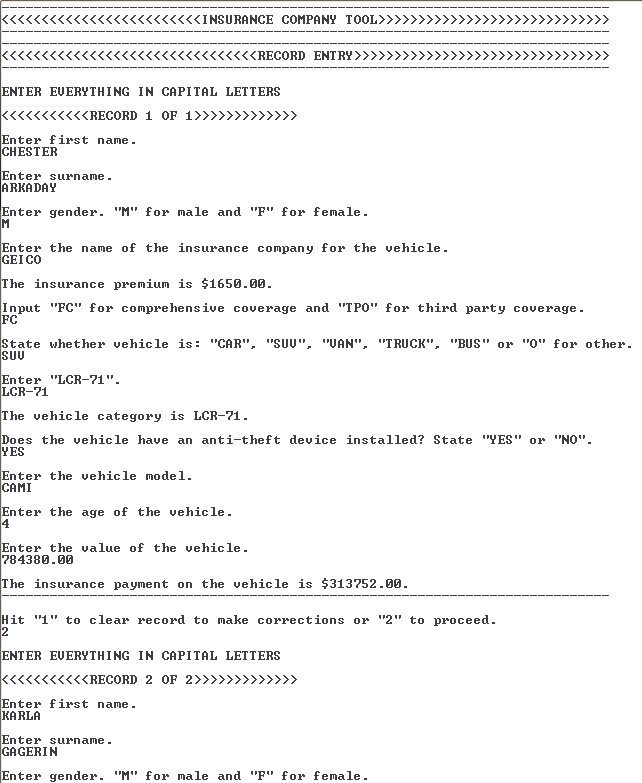
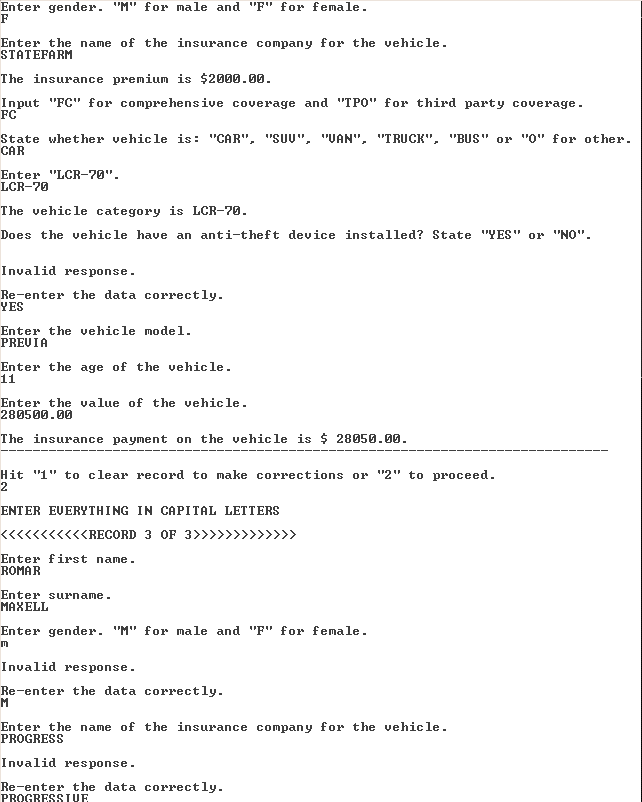
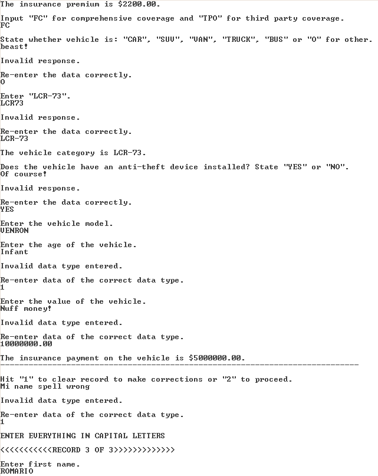
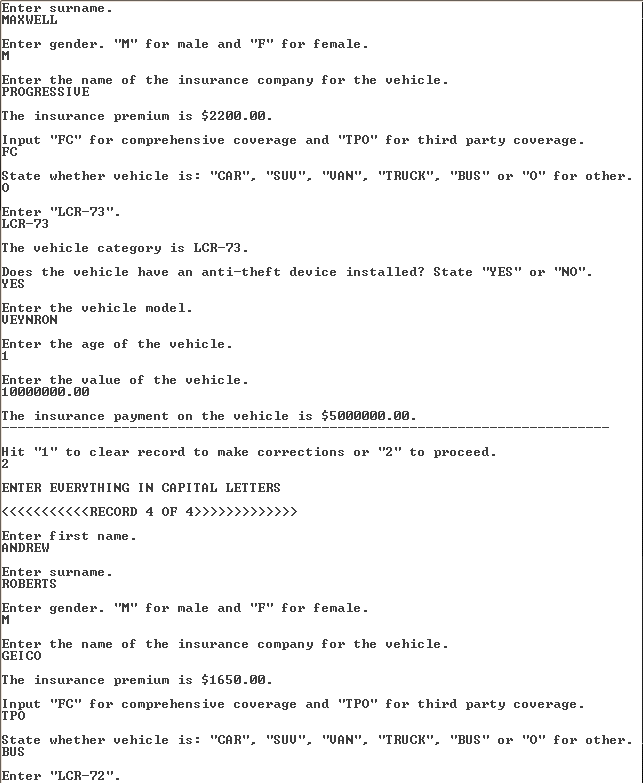
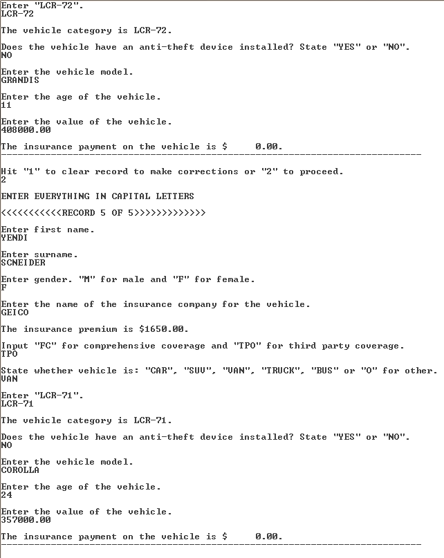
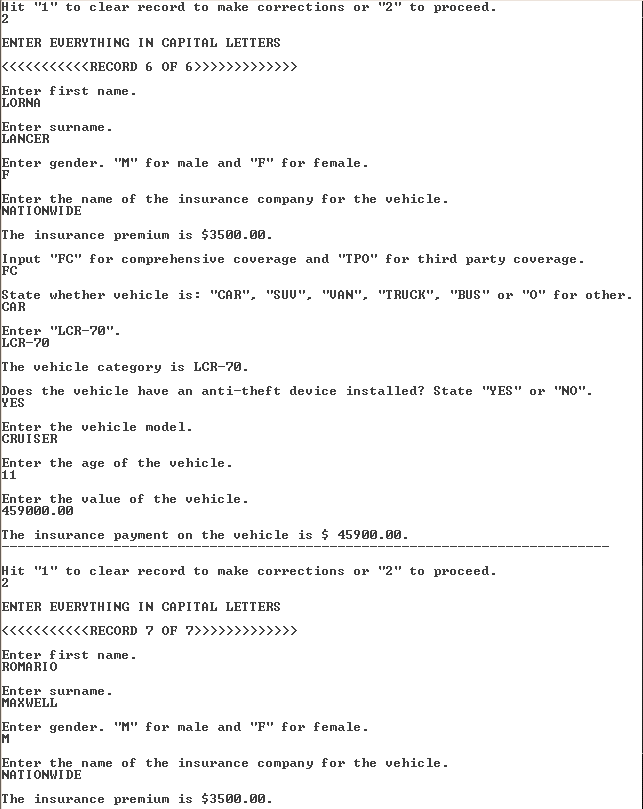
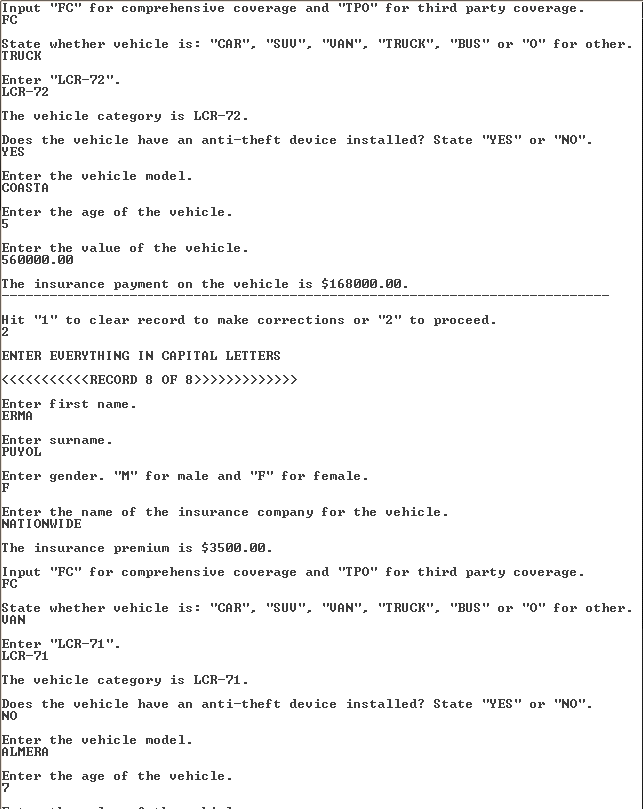
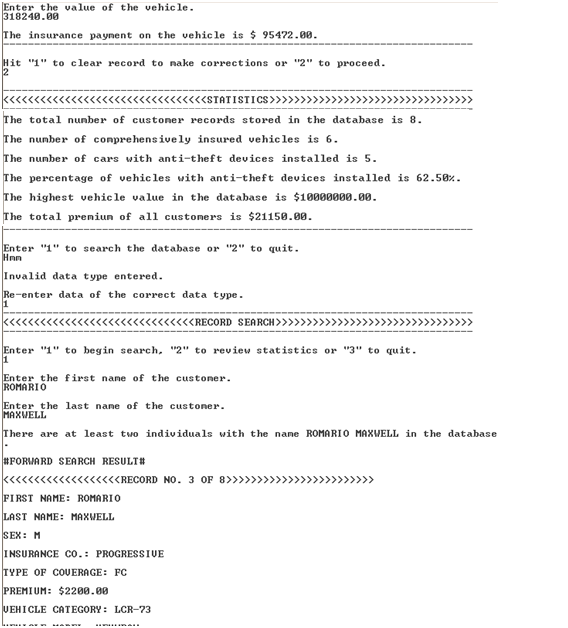
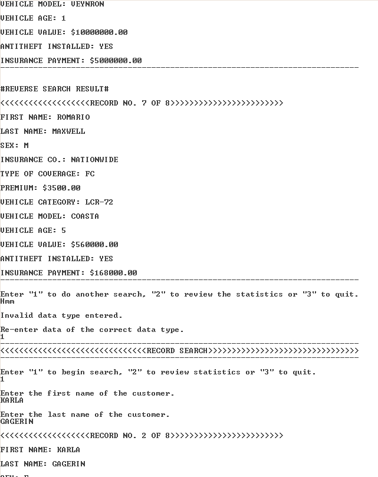
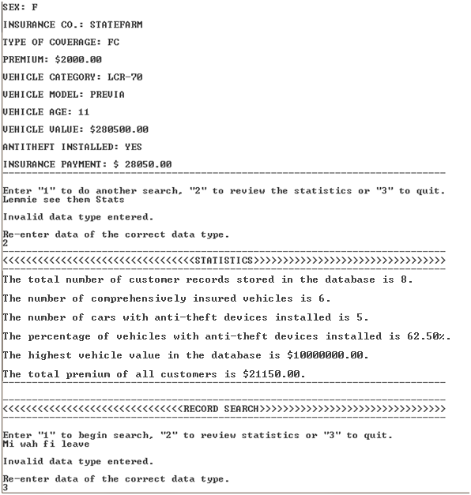

# PROBLEM SOLVING & PROGRAMMING DEV-PASCAL

## Problem Statement

Insurance companies find it time consuming and inefficient in dealing with
customers by present means. Additionally, the companies need to quickly
consider the data and results of the investigation carried out by the team of
analysts contracted by the NMTRO in order to implement policy changes and
premium increases if deemed necessary in time for the fiscal year’s quarter.
The companies need to rely on user input from the customers themselves to
obtain their information accurately and quickly and make necessary calculations
for their insurance payments as well as be able to search for customer
information quickly. The companies also need to calculate statistics from the
input data that may be seen clearly and readily.

## Pseudo Code

```
1    BEGIN
2    DISPLAY “---------------------------------------------------------“
3    DISPLAY “<<<<<<INSURANCE COMPANY TOOL>>>>>>”
4    DISPLAY “---------------------------------------------------------“
5    f_name:ARRAY = [1..30]
6    l_name:ARRAY = [1..30]
7    sex:ARRAY = [1..30]
8    car_type:ARRAY = [1..30]
9    car_cat:ARRAY = [1..30]
10   car_mod:ARRAY = [1..30]
11   insurance_co:ARRAY = [1..30]
12   toc:Array = [1..30]
13   antitheft:ARRAY = [1..30]
14   car_val:ARRAY = [1..30]
15   premium:ARRAY = [1..30]
16   car_age:ARRAY = [1..30]
17   insurance_pay:ARRAY = [1..30]
18   percent_antitheft = 0
19   geicoprem = 1650
20   statefarmprem = 2000
21   progressiveprem = 2200
22   nationwideprem = 3500
23   found1 = false
24   found2 = false
25   found3 = false
26   found4 = false
27   v = 30
28   u = 30
29   s = 1
30   m = 1
31   research = 0
32   search_con = 0
33   x = 0
34   hval = 0
35   tot_prem = 0
36   premium[x] = 0
37   car_age[x] = 0
38   car_val[x] = 0
39   insurance_pay[x] = 0
40   no_cars_antitheft = 0
41   no_cars_fc = 0
42   DISPLAY “------------------------------------“
43   DISPLAY “<<<<<RECORD ENTRY>>>>>”
44   DISPLAY “------------------------------------“
45   FOR x = 1 TO 30 DO
46   DISPLAY “ENTER EVERYTHING IN CAPITAL LETTERS”
47   DISPLAY “<<<<<<RECORD”, x, “OF”, x,”>>>>>>”
48   DISPLAY “Enter first name.”
49   READ f_name[x]
50   DISPLAY “Enter surname.”
51   READ l_name[x]
52   DISPLAY  “Enter gender. ‘M’ for male and ‘F’ for female”
53   READ sex[x]
54   DISPLAY “Enter the insurance company of the vehicle.”
55   READ insurance_co[x]
56   IF insurance_co[x] = GEICO THEN
57   premium[x] = geicoprem
58   ELSE
59   IF insurance_co[x] = PROGRESSIVE THEN
60   premium[x] = progressiveprem
61   ELSE
62   IF insurance_co[x] = STATEFARM THEN
63   premium[x] = statefarmprem
64   ELSE
65   premium[x] = nationwideprem
66   ENDIF
67   DISPLAY “The insurance premium is $”, premium[x],”.”
68   tot_prem = tot_prem + premium[x]
69   DISPLAY “Input ‘FC’ for comprehensive coverage and ‘TPO’ for third party coverage.”
70   READ toc[x]
71   IF toc[x] = FC THEN
72   no_cars_fc = no_cars_fc + 1
73   ENDIF
74   DISPLAY “State whether vehicle is: ‘CAR’, "SUV’, ‘VAN’, ‘TRUCK’, ‘BUS’ or ‘O’ for other.”
75   READ car_type[x]
76   IF car_type[x] = CAR THEN
77   DISPLAY “Enter LCR-70”
78   READ car_cat[x]
79   ELSE
80   IF car_type[x] = SUV or car_type[x] = VAN THEN
81   DISPLAY “Enter LCR-71”
82   READ car_cat[x]
85   ELSE
86   IF car_type[x] = TRUCK or car_type[x] = BUS THEN
87   DISPLAY “Enter LCR-72”
88   READ car_cat[x]
89   ELSE
90   DISPLAY “Enter LCR-73”
91   READ car_cat[x]
92   ENDIF
93   DISPLAY “The vehicle category is “, car_cat[x],”.”
94   DISPLAY “Does the vehicle have an anti-theft device installed? State ‘YES’ or ‘NO’.”
95   READ antitheft[x]
96   IF antitheft[x] = YES THEN
97    no_cars_antitheft = no_cars_antitheft + 1
98   ENDIF
99   DISPLAY “Enter the vehicle model”
100  READ car_mod[x]
101  DISPLAY “Enter the age of the vehicle.”
102  READ car_age[x]
103  DISPLAY “Enter the value of the vehicle.”
104  READ car_val[x]
105  IF hval < car_val[x] THEN
106  hval = car_val[x]
107  ENDIF
108  IF toc[x] = FC AND car_age[x] <= 1 THEN
109  insurance_pay[x] =- 0.5 * car_val[x]
110  ELSE
111  IF toc[x] = FC AND car_age[x] <= 4 THEN
112  insurance_pay[x] = 0.4 * car_val[x]
113  ELSE
114  IF toc[x] = FC AND car_age[x] <= 7 THEN
115  insurance_pay[x] = 0.3 * car_val[x]
116  ELSE
117  IF toc[x] = FC AND car_age[x] <= 10 THEN
118  insurance_pay[x] = 0.2 * car_val[x]
119  ELSE
120  IF toc[x] = FC AND car_age[x] > 10 THEN
121  insurance_pay[x] = 0.1 * car_val[x]
122  ELSE
123  insurance_pay[x] = 0
124  ENDIF
125  DISPLAY “The insurance payment on the vehicle is $”, insurance_pay[x],”.”
126  DISPLAY “------------------------------------------------------------------------------------“
127  DISPLAY “Enter ‘1’ to clear record to make corrections or ‘2’ to proceed.”
128  READ clearcorr
129  IF clearcorr = 1 THEN
130  no_cars_antitheft := no_cars_antitheft - 1;
131  no_cars_fc := no_cars_fc - 1;
132  tot_prem := tot_prem - premium[x];
133  x = x -1
134  ENDIF
135  ENDFOR
136  DISPLAY “-------------------------------------------------------------------------------“
137  DISPLAY “<<<<<<<<<<<<<<<<<<<<STATISTICS>>>>>>>>>>>>>>>>>>>>”
138  DISPLAY “-------------------------------------------------------------------------------“
139  DISPLAY “The total number of customer records in the database is “,x,”.”
140  DISPLAY “The number of comprehensively insured vehicles is “, no_cars_fc,”.”
141  DISPLAY “The number of cars with anti-theft devices installed is “, no_cars_antitheft,”.”
142  percent_antitheft = “no_cars_antitheft/x” * 100
143  DISPLAY “The percentage of vehicles with anti-theft devices installed is “, percent_antitheft,”.”
144  DISPLAY “The highest vehicle value in the database is $”, h_val,”.”
145  DISPLAY “The total premium of all customers is $”, tot_prem,”.”
146  DISPLAY “---------------------------------------------------------------------------------------------------------------------“
147  DISPLAY “---------------------------------------------------------------------------“
148  DISPLAY “<<<<<<<<<<<<<<RECORD SEARCH>>>>>>>>>>>>>>>>>>>”
149  DISPLAY ”----------------------------------------------------------------------------“
150  WHILE search_con = 0 OR search_con = 1 OR search_con = 2 DO
151  DISPLAY “Enter ‘1’ to begin search, ‘2’ to review statistics or ‘3’ to quit.”
152  READ search_con
153  IF search_con = 1 THEN
154  DISPLAY ” Enter the first name of the customer.”
155  READ field1
156  WHILE found1 = false AND m <= 30 DO
157  IF f_name[m] = field1 THEN
158  found1 = true
159  ENDIF
160  ELSE
161  m = m+1
162  ENDWHILE
163  DISPLAY “Enter the last name of the customer.”
164  READ field2
165  WHILE found2 = false AND s <= 30 DO
166  IF l_name[s] = field2 THEN
167  found2 = true
168  ENDIF
169  ELSE
170  s = s+1
171  ENDWHILE
172  WHILE found3 = false AND u <= 30 DO
173  IF f_name[u] = field1 THEN
174  found3 = true
175  ENDIF
176  ELSE
177  u = u-1
178  ENDWHILE
179  WHILE found4 = false AND v <= 30 DO
180  IF l_name[v] = field2 THEN
181  found4 = true
182  ENDIF
183  ELSE
184  v = v-1
185  ENDWHILE
186  IF m = s AND u = v AND found1 = true AND found2 = true AND found3 = true AND found4 = true AND m <> u AND s <> v THEN
187  DISPLAY “There are at least two individuals with the name “,f_name[m],” “,l_name[m],” in the database.”
188  DISPLAY “#FORWARD SEARCH RESULT#”
189  DISPLAY “<<<<<<<<<<<<<<<<<<<RECORD NO. “,m,” OF “,x,”>>>>>>>>>>>>>>>>>>>>>>>>”
190  DISPLAY “FIRST NAME: “,f_name[m]
191  DISPLAY “LAST NAME: “,l_name[m]
192  DISPLAY “SEX: ”,sex[m]
193  DISPLAY “INSURANCE CO.: “,insurance_co[m]
194  DISPLAY “TYPE OF COVERAGE: “,toc[m]
195  DISPLAY “PREMIUM: $”,premium[m]
196  DISPLAY “VEHICLE CATEGORY: “,car_cat[m]
197  DISPLAY “VEHICLE MODEL: “,car_mod[m]
198  DISPLAY “VEHICLE AGE: “,car_age[m]
199  DISPLAY “VEHICLE VALUE: $”,car_val[m]
200  DISPLAY “ANTITHEFT INSTALLED: “,antitheft[m]
201  DISPLAY “INSURANCE PAYMENT: $”,insurance_pay[m]
202  DISPLAY “----------------------------------------------------------------------------“
203  READ
204  DISPLAY “#REVERSE SEARCH RESULT#”
205  DISPLAY “<<<<<<<<<<<<<<<<<<<RECORD NO. “,u,” OF “,x,”>>>>>>>>>>>>>>>>>>>>>>>>”
206  DISPLAY “FIRST NAME: “,f_name[u]
207  DISPLAY “LAST NAME: “,l_name[u]
208  DISPLAY “SEX: ”,sex[u]
209  DISPLAY “INSURANCE CO.: “,insurance_co[u]
210  DISPLAY “TYPE OF COVERAGE: “,toc[u]
211  DISPLAY “PREMIUM: $”,premium[u]
212  DISPLAY “VEHICLE CATEGORY: “,car_cat[u]
213  DISPLAY “VEHICLE MODEL: “,car_mod[u]
214  DISPLAY “VEHICLE AGE: “,car_age[u]
215  DISPLAY “VEHICLE VALUE: $”,car_val[u]
216  DISPLAY “ANTITHEFT INSTALLED: “,antitheft[u]
217  DISPLAY “INSURANCE PAYMENT: $”,insurance_pay[u]
218  DISPLAY “----------------------------------------------------------------------------“
219  READ
220  ENDIF
221  ELSE
222  IF m = s AND found1 = true AND found2 = true THEN
223  DISPLAY “<<<<<<<<<<<<<<<<<<<RECORD NO. “,m,” OF “,x,”>>>>>>>>>>>>>>>>>>>>>>>>”
224  DISPLAY “FIRST NAME: “,f_name[m]
225  DISPLAY “LAST NAME: “,l_name[m]
226  DISPLAY “SEX: ”,sex[m]
227  DISPLAY “INSURANCE CO.: “,insurance_co[m]
228  DISPLAY “TYPE OF COVERAGE: “,toc[m]
229  DISPLAY “PREMIUM: $”,premium[m]
230  DISPLAY “VEHICLE CATEGORY: “,car_cat[m]
231  DISPLAY “VEHICLE MODEL: “,car_mod[m]
232  DISPLAY “VEHICLE AGE: “,car_age[m]
233  DISPLAY “VEHICLE VALUE: $”,car_val[m]
234  DISPLAY “ANTITHEFT INSTALLED: “,antitheft[m]
235  DISPLAY “INSURANCE PAYMENT: $”,insurance_pay[m]
236  DISPLAY “----------------------------------------------------------------------------“
237  READ
238  ENDIF
239  ELSE
240  DISPLAY “<<<NO RECORD FOUND>>>”
241  READ
242  ENDIF
243  ELSE
244  IF search_con = 2 THEN
245  DISPLAY “-------------------------------------------------------------------------------“
246  DISPLAY “<<<<<<<<<<<<<<<<<<<<STATISTICS>>>>>>>>>>>>>>>>>>>>”
247  DISPLAY “-------------------------------------------------------------------------------“
248  DISPLAY “The total number of customer records in the database is “,x,”.”
249  DISPLAY “The number of comprehensively insured vehicles is “, no_cars_fc,”.”
250  DISPLAY “The number of cars with anti-theft devices installed is “, no_cars_antitheft,”.”
251  percent_antitheft = (no_cars_antitheft/x) * 100
252  DISPLAY “The percentage of vehicles with anti-theft devices installed is “, percent_antitheft,”.”
253  DISPLAY “The highest vehicle value in the database is $”, h_val,”.”
254  DISPLAY “The total premium of all customers is $”, tot_prem,”.”
255  DISPLAY “---------------------------------------------------------------------------------------------------------------------“
256  ENDIF
257  ELSE
258  END
259  ENDWHILE
260  END
```

## Trace Tables

### Declared Constants

| geicoprem | progressiveprem | nationwideprem | statefarmprem |
|-----------|-----------------|----------------|---------------|
| 1650.00   | 2200.00         | 2000.00        | 3500.00       |

### Procedure Input_Dat

x | f_name[x] | l_name[x] | sex[x] | insurance_co[x] | premium[x] | toc[x] | car_type[x] | car_cat[x] | antitheft[x] | car_mod[x] | car_age[x] | car_val[x] | insurance_pay[x] | hval
-- | --------- | --------- | ------ | --------------- | ---------- | ------ | ----------- | ---------- | ------------ | ---------- | ---------- | ---------- | ---------------- | ----
0 | | | | | | | | | | | | | | 
1 | CHESTER | ARKADAY | M | GEICO | geicoprem | FC | SUV | LCR-71 | YES | CAMI | 4 | 784380.00 | 313752.00 | 784380.00
2 | KARLA | GAGERIN | F | STATEFARM | statefarmprem | FC | CAR | LCR-70 | YES | PREVIA | 11 | 280500.00 | 28050.00 | 784380.00
3 | ROMARIO | MAXWELL | M | PROGRESSIVE | progressiveprem | FC | O | LCR-73 | YES | VEYNRON | 1 | 10000000.00 | 500000.00 | 10000000.00
4 | ANDREW | ROBERTS | M | GEICO | geicoprem | TPO | BUS | LCR-72 | NO | GRANDIS | 11 | 408000.00 | 0 | 10000000.00
5 | YENDI | SCNEIDER | F | GEICO | geicoprem | TPO | VAN | LCR-71 | NO | COROLLA | 24 | 357000.00 | 0 | 10000000.00
6 | LORNA | LANCER | F | NATIONWIDE | nationwideprem | FC | CAR | LCR-70 | YES | CRUISER | 11 | 459000.00 | 45900.00  | 10000000.00
7 | ROMARIO | MAXWELL | M | NATIONWIDE | nationwideprem | FC | BUS | LCR-72 | YES | COASTA | 5 | 560000.00 | 168000.00 | 10000000.00
8 | ERMA | PUYOL | F | NATIONWIDE | nationwideprem | FC | VAN | LCR-71 | NO | ALMERA | 7 | 318240.00 | 95472.00  | 10000000.00

| tot_prem | no_cars_fc | no_cars_antitheft |
|----------|------------|-------------------|
|          |            |                   |
| 1650.00  | 1          | 1                 |
| 5150.00  | 2          | 2                 |
| 7350.00  | 3          | 3                 |
| 9000.00  | 3          | 3                 |
| 10650.00 | 3          | 3                 |
| 14150.00 | 4          | 4                 |
| 7650.00  | 5          | 5                 |
| 21150.00 | 6          | 5                 |

### Search When There Are At Least Two Customers With The Same Name

m | s | u | v | field1 | field2 | found1 | found2 | found3 | found4 | f_name[m] | l_name[m] | sex[m] | insurance_co[m] | premium[m] | car_cat[m] | car_mod[m]
--- | --- | --- | --- | ------ | ------ | ------ | ------ | ------ | ------ | --------- | --------- | ------ | --------------- | ---------- | ---------- | ----------
1 | 1 | 8 | 8 | ROMARIO | MAXWELL | false | false | false | false | | | | | | | 
2 | 2 | 7 | 7 | ROMARIO | MAXWELL | false | false | true | true | | | | | | | | 
3 | 3 | 7 | 7 | ROMARIO | MAXWELL | true | true | true | true | ROMARIO | MAXWELL | M | PROGRESSIVE | 2200.00 | LCR-73 | VEYNRON

car_age[m] | ca_val[m] | antitheft[m] | insurance_pay[m] | f_name[u] | l_name[u] | sex[u] | insurance_co[u] | premium[u] | car_cat[u] | car_mod[u] | car_age[u] | car_val[u]
---------- | --------- | ------------ | ---------------- | --------- | --------- | ------ | --------------- | ---------- | ---------- | ---------- | ---------- | ----------
 | | | | | | | | | | | | 
 | | | | ROMARIO | MAXWELL | M | NATIONWIDE | 3500.00 | LCR-72 | COASTA | 5 | 560000.00
1 | 10000000.00 | YES | 5000000.00 | ROMARIO | MAXWELL | M | NATIONWIDE | 3500.00 | LCR-72 | COASTA | 5 | 560000.00

| antitheft[u] | insurance_pay[u] | toc[m] | toc[u] |
|--------------|------------------|--------|--------|
| YES          | 168000.00        |        | FC     |
| YES          | 168000.00        | FC     | FC     |

### Search With One Return Value

m | s | field1 | field2 | found1 | found2 | f_name[m] | l_name[m] | sex[m] | insurance_co[m] | premium[m] | car_cat[m] | car_mod[m] | car_age[m] | car_val[m] | antitheft[m] | toc[m]
--- | --- | ------ | ------ | ------ | ------ | --------- | --------- | ------ | --------------- | ---------- | ---------- | ---------- | ---------- | ---------- | ------------ | ------
1 | 1 | KARLA | GAGERIN | false | false | | | | | | | | | | | 
2 | 2 | KARLA | GAGERIN | true | true | KARLA | GAGERIN | F | STATEFARM | 2000.00 | LCR-70 | PREVIA | 11 | 280500.00 | YES | FC

| insurance_pay[m] |
|------------------|
|                  |
| 28050.00         |

## Test Data

First Name | Last Name | Gender | Car Model | Car Category | Car Age | Insurance Company | TOC | Anti-theft Installed (Y/N) | Premium ($) | Value ($) | Insurance Payment ($)
---------- | --------- | ------ | --------- | ------------ | ------- | ----------------- | --- | -------------------------- | ----------- | --------- | ---------------------
Chester | Arkaday | M | Cami | LCR-71 | 4 | GEICO | FC | YES | 1,650.00 | 784,380.00 | 313,752.00
Karla | Gagerin | F | Previa | LCR-70 | 11 | STATEFARM | FC | YES | 2,000.00 | 280,500.00 | 28,050.00
Andrew | Roberts | M | Grandis | LCR-72 | 11 | GEICO | TPO | NO | 1,650.00 | 408,000.00 | 0
Yendi | Scneider | F | Corolla | LCR-71 | 24 | GEICO | TPO | NO | 1,650.00 | 357,000.00 | 0
Lorna | Lancer | F | Cruiser | LCR-70 | 11 | NATIONWIDE | FC | YES | 3,500.00 | 459,000.00 | 45,900.00
Erma | Puyol | F | Almera | LCR-71 | 7 | NATIONWIDE | FC | NO | 3,500.00 | 318,240.00 | 95,472.00

### DATA OBTAINED FROM VICTIMS SHEET OF TASK C OF SPREADSHEET SECTION

First Name | Last Name | Gender | Car Model | Car Category | Car Age | Insurance Company | TOC | Anti-theft Installed (Y/N) | Premium ($) | Value ($)
---------- | --------- | ------ | --------- | ------------ | ------- | ----------------- | --- | -------------------------- | ----------- | ---------
Romario | Maxwell | M | Coasta | LCR-72 | 5 | NATIONWIDE | FC | YES | 3,500.00 | 560,000.00
Romario | Maxwell | M | Veynron | LCR-73 | 1 | PROGRESSIVE | FC | YES | 2,200.00 | 10,000,000.00

### FICTICIOUS RECORDS FOR MYSELF TO TEST ADDITIONAL PROGRAM PATHWAYS

## Source Code

```pascal
PROGRAM Insurance_GTA;

USES crt;

{Author: Romario A. Maxwell
School: Campion College
Territory: Jamaica
Centre No.: 100016
Date:March 20, 2012
Program description: The program will prompt, accept and store insurance company
customers’ details, generate statistics from input data and calculate insurance
paymets. This program will also facilitate the search, retrieval and display of
a customer’s details.
}

CONST
      geicoprem = 1650.00;
      nationwideprem = 3500.00;
      statefarmprem = 2000.00;
      progressiveprem = 2200.00;

VAR
      f_name:ARRAY[1..30] of STRING;
      l_name:ARRAY[1..30] of STRING;
      sex:ARRAY[1..30] of STRING;
      car_type:ARRAY[1..30] of STRING;
      car_cat:ARRAY[1..30] of STRING;
      car_mod:ARRAY[1..30] of STRING;
      insurance_co:ARRAY[1..30] of STRING;
      toc:Array[1..30] of STRING;
      antitheft:ARRAY[1..30] of STRING;
      car_val:ARRAY[1..30] of REAL;
      premium:ARRAY[1..30] of REAL;
      car_age:ARRAY[1..30] of INTEGER;
      insurance_pay:ARRAY[1..30] of REAL;
      x, m, s, no_cars_fc, optdatsearch, clearcorr, v, u, search_con, error1, error2, error3, error4, error5, error6, research, no_cars_antitheft:INTEGER;
      tot_prem, percent_antitheft, hval:REAL;
      field1, str1, str2, str3, str4, str5, str6, field2:STRING;
      found1, found2, found3, found4:BOOLEAN;

PROCEDURE Input_Dat;
          BEGIN
               tot_prem := 0;
               premium[x] := 0;
               car_age[x] := 0;
               car_val[x] := 0;
               insurance_pay[x] := 0;
               hval := 0;
               no_cars_antitheft := 0;
               no_cars_fc := 0;
               x := 0;
               error1 := 0;
               error2 := 0;
    error6 := 0;
    clearcorr := 0;
               str1 := ‘0’;
               str2 := ‘0’;
    str6 := ‘0’;
               WRITELN(‘---------------------------------------------------------------------------------------’);
               WRITELN(‘<<<<<<<<<<<<<<<<<<<<<<<<<<<<<<<<RECORD ENTRY>>>>>>>>>>>>>>>>>>>>>>>>>>>>>>>>‘);
               WRITELN(‘----------------------------------------------------------------------------------------’);
               WRITELN;
               FOR x:= 1 TO 30 DO
                   BEGIN
                        WRITELN('ENTER EVERYTHING IN CAPITAL LETTERS');
                        WRITELN;
         WRITELN(‘<<<<<<<<<<<RECORD ‘,x,’ OF ‘,x,’>>>>>>>>>>>>>‘);
                        WRITELN;
                        WRITELN(‘Enter first name.’);
                        READLN(f_name[x]);
                        WRITELN;
                        WRITELN(‘Enter surname.’);
                        READLN(l_name[x]);
                        WRITELN;
                        WRITELN(‘Enter gender. Input “M” for male and “F” for female.’);
                        READLN(sex[x]);
                        WHILE ((sex[x] <> ‘M’) AND (sex[x] <> ‘F’)) DO
                              BEGIN
                                   WRITELN;
                                   WRITELN(‘Invalid response.’);
                                   WRITELN;
                                   WRITELN(‘Re-enter the data correctly.’);
                                   READLN(sex[x]);
                              END;
                        WRITELN;
                        WRITELN(‘Enter the name of the insurance company for the vehicle.’);
                        READLN(insurance_co[x]);
                        WHILE ((insurance_co[x] <> ‘GEICO’) AND (insurance_co[x] <> ‘STATEFARM’) AND (insurance_co[x] <> ‘PROGRESSIVE’) AND (insurance_co[x] <> ‘NATIONWIDE’)) DO
                              BEGIN
                                   WRITELN;
                                   WRITELN(‘Invalid response.’);
                                   WRITELN;
                                   WRITELN(‘Re-enter the data correctly.’);
                                   READLN(insurance_co[x]);
                              END;
                        IF insurance_co[x] = ‘GEICO’ THEN
                           BEGIN
                                premium[x] := geicoprem;
                           END
                        ELSE
                            IF insurance_co[x] = ‘STATEFARM’ THEN
                               BEGIN
                                    premium[x] := statefarmprem;
                               END
                            ELSE
                                IF insurance_co[x] = ‘PROGRESSIVE’ THEN
                                   BEGIN
                                        premium[x] := progressiveprem;
                                   END
                                ELSE
                                    BEGIN
                                         premium[x] := nationwideprem;
                                    END;
                        WRITELN;
                        WRITELN(‘The insurance premium is $’,premium[x]:4:2,’.’);
                        tot_prem := tot_prem + premium[x];
                        WRITELN;
                        WRITELN(‘Input “FC” for comprehensive coverage and “TPO” for third party coverage.’);
                        READLN(toc[x]);
                        WHILE ((toc[x] <> ‘FC’) AND (toc[x] <> ‘TPO’)) DO
                              BEGIN
                                   WRITELN;
                                   WRITELN(‘Invalid response.’);
                                   WRITELN;
                                   WRITELN(‘Re-enter the data correctly.’);
                                   READLN(toc[x]);
                        END;
                        IF toc[x] = ‘FC’ THEN
                           no_cars_fc := no_cars_fc + 1;
                        WRITELN;
                        WRITELN(‘State whether vehicle is: “CAR”, “SUV”, “VAN”, “TRUCK”, “BUS” or “O” for other.’);
                        READLN(car_type[x]);
                        WHILE ((car_type[x] <> ‘CAR’) AND (car_type[x] <> ‘SUV’) AND (car_type[x] <> ‘VAN’) AND (car_type[x] <> ‘TRUCK’) AND (car_type[x] <> ‘BUS’) AND (car_type[x] <> ‘O’)) DO
                              BEGIN
                                   WRITELN;
                                   WRITELN(‘Invalid response.’);
                                   WRITELN;
                                   WRITELN(‘Re-enter the data correctly.’);
                                   READLN(car_type[x]);
                        END;
                        WRITELN;
                        IF car_type[x] = ‘CAR’ THEN
                           BEGIN
                                WRITELN(‘Enter “LCR-70”.’);
                                READLN(car_cat[x]);
                                WHILE (car_cat[x] <> ‘LCR-70’) DO
                                      BEGIN
                                           WRITELN;
                                           WRITELN(‘Invalid response.’);
                                           WRITELN;
                                           WRITELN(‘Re-enter the data correctly.’);
                                           READLN(car_cat[x]);
                                      END;
                           END
                        ELSE
                            IF ((car_type[x] = ‘SUV’) or (car_type[x] = ‘VAN’)) THEN
                               BEGIN
                                    WRITELN(‘Enter “LCR-71”.’);
                                    READLN(car_cat[x]);
                                    WHILE (car_cat[x] <> ‘LCR-71’) DO
                                          BEGIN
                                               WRITELN;
                                               WRITELN(‘Invalid response.’);
                                               WRITELN;
                                               WRITELN(‘Re-enter the data correctly.’);
                                               READLN(car_cat[x]);
                                          END;
                               END
                            ELSE
                                IF ((car_type[x] = ‘TRUCK’) or (car_type[x] = ‘BUS’)) THEN
                                   BEGIN
                                        WRITELN(‘Enter “LCR-72”.’);
                                        READLN(car_cat[x]);
                                        WHILE (car_cat[x] <> ‘LCR-72’) DO
                                              BEGIN
                                                   WRITELN;
                                                   WRITELN(‘Invalid response.’);
                                                   WRITELN;
                                                   WRITELN(‘Re-enter the data correctly.’);
                                                   READLN(car_cat[x]);
                                              END;
                                   END
                                ELSE
                                    BEGIN
                                         WRITELN(‘Enter “LCR-73”.’);
                                         READLN(car_cat[x]);
                                         WHILE (car_cat[x] <> ‘LCR-73’) DO
                                               BEGIN
                                                    WRITELN;
                                                    WRITELN(‘Invalid response.’);
                                                    WRITELN;
                                                    WRITELN(‘Re-enter the data correctly.’);
                                                    READLN(car_cat[x]);
                                               END;
                                    END;
                        WRITELN;
                        WRITELN(‘The vehicle category is ‘,car_cat[x],’.’);
                        WRITELN;
                        WRITELN(‘Does the vehicle have an anti-theft device installed? State “YES” or “NO”.’);
                        READLN(antitheft[x]);
                        WHILE ((antitheft[x] <> ‘YES’) AND (antitheft[x] <> ‘NO’)) DO
                              BEGIN
                                   WRITELN;
                                   WRITELN(‘Invalid response.’);
                                   WRITELN;
                                   WRITELN(‘Re-enter the data correctly.’);
                                   READLN(antitheft[x]);
                        END;
                        IF antitheft[x] = ‘YES’ THEN
                           no_cars_antitheft := no_cars_antitheft+1;
                        WRITELN;
                        WRITELN(‘Enter the vehicle model.’);
                        READLN(car_mod[x]);
                        WRITELN;
                        WRITELN(‘Enter the age of the vehicle.’);
                        READLN(str1);
                        VAL(str1, car_age[x], error1);
                        WHILE error1 <> 0 DO
                              BEGIN
                                   WRITELN;
                                   WRITELN(‘Invalid data type entered.’);
                                   WRITELN;
                                   WRITELN(‘Re-enter data of the correct data type.’);
                                   READLN(str1);
                                   VAL(str1, car_age[x], error1);
                              END;
                        WRITELN;
                        WRITELN(‘Enter the value of the vehicle.’);
                        READLN(str2);
                        VAL(str2, car_val[x], error2);
                        WHILE error2 <> 0 DO
                              BEGIN
                                   WRITELN;
                                   WRITELN(‘Invalid data type entered.’);
                                   WRITELN;
                                   WRITELN(‘Re-enter data of the correct data type.’);
                                   READLN(str2);
                                   VAL(str2, car_val[x], error2);
                              END;
                        IF hval < car_val[x] THEN
                           hval := car_val[x];
                        IF ((toc[x] = ‘FC’) AND (car_age[x] <= 1)) THEN
                           BEGIN
                                insurance_pay[x] := 0.5*car_val[x];
                           END
                        ELSE
                            IF ((toc[x] = ‘FC’) AND (car_age [x] <= 4)) THEN
                               BEGIN
                                    insurance_pay[x] := 0.4*car_val[x];
                               END
                            ELSE
                                IF ((toc[x] = ‘FC’) AND (car_age[x] <= 7)) THEN
                                   BEGIN
                                        insurance_pay[x] := 0.3*car_val[x];
                                   END
                                ELSE
                                    IF ((toc[x] = ‘FC’) AND (car_age[x] <= 10)) THEN
                                       BEGIN
                                            insurance_pay[x] := 0.2*car_val[x];
                                       END
                                    ELSE
                                        IF ((toc[x] = ‘FC’) AND (car_age[x] > 10)) THEN
                                           BEGIN
                                             insurance_pay[x] := 0.1*car_val[x];
                                           END
                                        ELSE
                                            BEGIN
                                                 insurance_pay[x] := 0.00;
                                            END;
                        WRITELN;
                        WRITELN(‘The insurance payment on the vehicle is $’,insurance_pay[x]:9:2,’.’);
                        WRITELN(‘----------------------------------------------------------------------------’);
         READLN;
                        WRITELN('Hit "1" to clear record to make corrections or "2" to proceed.');
                        READLN(str6);
                        VAL(str6, clearcorr, error6);
                        WHILE error6 <> 0 DO
                              BEGIN
                                   WRITELN;
                                   WRITELN('Invalid data type entered.');
                                   WRITELN;
                                   WRITELN('Re-enter data of the correct data type.');
                                   READLN(str6);
                                   VAL(str6, clearcorr, error6);
                              END;
                        IF clearcorr = 1 THEN
                           BEGIN
no_cars_antitheft := no_cars_antitheft - 1;
                                no_cars_fc := no_cars_fc - 1;
                                tot_prem := tot_prem - premium[x];
                                x := x - 1
                           END
                        ELSE
                            BEGIN
                            END;
                            WRITELN;
                   END;
          END;
{This procedure allows insurance customer information to be input and stored
}

Procedure Stats;
          BEGIN
               percent_antitheft := 0;
               WRITELN(‘--------------------------------------------------------------------------------------’);
               WRITELN(‘<<<<<<<<<<<<<<<<<<<<<<<<<<<<<<<<<STATISTICS>>>>>>>>>>>>>>>>>>>>>>>>>>>>>>>>>‘);
               WRITELN(‘---------------------------------------------------------------------------------------’);
               WRITELN;
               WRITELN(‘The total number of customer records stored in the database is ‘,x,’.’);
               WRITELN;
               WRITELN(‘The number of comprehensively insured vehicles is ‘,no_cars_fc,’.’);
               WRITELN;
               WRITELN(‘The number of cars with anti-theft devices installed is ‘,no_cars_antitheft,’.’);
               WRITELN;
               percent_antitheft:=(no_cars_antitheft/x)*100;
               WRITELN(‘The percentage of vehicles with anti-theft devices installed is ‘,percent_antitheft:3:2,’%.’);
               WRITELN;
               WRITELN(‘The highest vehicle value in the database is $’,hval:9:2,’.’);
               WRITELN;
               WRITELN(‘The total premium of all customers is $’,tot_prem:9:2,’.’);
               WRITELN(‘----------------------------------------------------------------------------’);
               READLN;
          END;

{This procedure generates statistical information from the stored records
}

Procedure SearchAndRetrieve;
          BEGIN
               error4 := 0;
               error3 := 0;
               v := 30;
               u := 30;
               s := 1;
               m := 1;
               research := 0;
               search_con := 0;
               str4 := ‘0’;
               str3 := ‘0’;
               found1 := false;
               found2 := false;
               found3 := false;
               found4 := false;
               WRITELN(‘-----------------------------------------------------------------------------------------’);
               WRITELN(‘<<<<<<<<<<<<<<<<<<<<<<<<<<<<<<<RECORD SEARCH>>>>>>>>>>>>>>>>>>>>>>>>>>>>>>>>‘);
               WRITELN(‘-----------------------------------------------------------------------------------------’);
               WRITELN;
               WRITELN(‘Enter “1” to begin search, “2” to review statistics or “3” to quit.’);
               READLN(str3);
               VAL(str3, search_con, error3);
               WHILE error3 <> 0 DO
                     BEGIN
                          WRITELN;
                          WRITELN(‘Invalid data type entered.’);
                          WRITELN;
                          WRITELN(‘Re-enter data of the correct data type.’);
                          READLN(str3);
                          VAL(str3, search_con, error3);
               END;
               IF search_con = 2 THEN
                  BEGIN
                       Stats;
                       SearchAndRetrieve;
                  END
               ELSE
                   IF search_con = 3 THEN
                      BEGIN
                           halt;
                      END;
               WRITELN;
               WRITELN(‘Enter the first name of the customer.’);
               READLN(field1);
               WRITELN;
               WHILE (found1 = false) AND (m <= 30) DO
                     BEGIN
                          IF (f_name[m] = field1) THEN
                             BEGIN
                                  found1 := true;
                             END
                          ELSE
                             m := m+1;
                             END;
               WRITELN(‘Enter the last name of the customer.’);
               READLN(field2);
               WRITELN;
               WHILE (found2 = false) AND (s <= 30) DO
                     BEGIN
                          IF (l_name[s] = field2) THEN
                             BEGIN
                                  found2 := true;
                             END
                          ELSE
                              s := s+1;
                              END;
               WHILE (found3 = false) AND (u <= 30) DO
                     BEGIN
                          IF (f_name[u] = field1) THEN
                             BEGIN
                                  found3 := true;
                             END
                          ELSE
                             u := u-1;
                             END;
               WHILE (found4 = false) AND (v <= 30) DO
                     BEGIN
                          IF (l_name[v] = field2) THEN
                             BEGIN
                                  found4 := true;
                             END
                          ELSE
                              v := v-1;
                              END;
               IF ((m = s) AND (u = v) AND (found1 = true) AND (found2 = true) AND (found3 = true) AND (found4 = true) AND (m <> u) AND (s <> v)) THEN
                  BEGIN
                       WRITELN(‘There are at least two individuals with the name ‘,f_name[m],’ ‘,l_name[m],’ in the database.’);
                       WRITELN;
                       WRITELN(‘#FORWARD SEARCH RESULT#’);
                       WRITELN;
                       WRITELN(‘<<<<<<<<<<<<<<<<<<<RECORD NO. ‘,m,’ OF ‘,x,’>>>>>>>>>>>>>>>>>>>>>>>>‘);
                       WRITELN;
                       WRITELN(‘FIRST NAME: ‘,f_name[m]);
                       WRITELN;
                       WRITELN(‘LAST NAME: ‘,l_name[m]);
                       WRITELN;
                       WRITELN(‘SEX: ‘,sex[m]);
                       WRITELN;
                       WRITELN(‘INSURANCE CO.: ‘,insurance_co[m]);
                       WRITELN;
                       WRITELN(‘TYPE OF COVERAGE: ‘,toc[m]);
                       WRITELN;
                       WRITELN(‘PREMIUM: $’,premium[m]:4:2);
                       WRITELN;
                       WRITELN(‘VEHICLE CATEGORY: ‘,car_cat[m]);
                       WRITELN;
                       WRITELN(‘VEHICLE MODEL: ‘,car_mod[m]);
                       WRITELN;
                       WRITELN(‘VEHICLE AGE: ‘,car_age[m]);
                       WRITELN;
                       WRITELN(‘VEHICLE VALUE: $’,car_val[m]:9:2);
                       WRITELN;
                       WRITELN(‘ANTITHEFT INSTALLED: ‘,antitheft[m]);
                       WRITELN;
                       WRITELN(‘INSURANCE PAYMENT: $’,insurance_pay[m]:9:2);
                       WRITELN(‘----------------------------------------------------------------------------’);
                       READLN;
                       WRITELN;
                       WRITELN(‘#REVERSE SEARCH RESULT#’);
                       WRITELN;
                       WRITELN(‘<<<<<<<<<<<<<<<<<<<RECORD NO. ‘,u,’ OF ‘,x,’>>>>>>>>>>>>>>>>>>>>>>>>‘);
                       WRITELN;
                       WRITELN(‘FIRST NAME: ‘,f_name[u]);
                       WRITELN;
                       WRITELN(‘LAST NAME: ‘,l_name[u]);
                       WRITELN;
                       WRITELN(‘SEX: ‘,sex[u]);
                       WRITELN;
                       WRITELN(‘INSURANCE CO.: ‘,insurance_co[u]);
                       WRITELN;
                       WRITELN(‘TYPE OF COVERAGE: ‘,toc[u]);
                       WRITELN;
                       WRITELN(‘PREMIUM: $’,premium[u]:4:2);
                       WRITELN;
                       WRITELN(‘VEHICLE CATEGORY: ‘,car_cat[u]);
                       WRITELN;
                       WRITELN(‘VEHICLE MODEL: ‘,car_mod[u]);
                       WRITELN;
                       WRITELN(‘VEHICLE AGE: ‘,car_age[u]);
                       WRITELN;
                       WRITELN(‘VEHICLE VALUE: $’,car_val[u]:9:2);
                       WRITELN;
                       WRITELN(‘ANTITHEFT INSTALLED: ‘,antitheft[u]);
                       WRITELN;
                       WRITELN(‘INSURANCE PAYMENT: $’,insurance_pay[u]:9:2);
                       WRITELN(‘----------------------------------------------------------------------------’);
                       READLN;
                  END
               ELSE
                   IF ((m = s) AND (found1 = true) AND (found2 = true)) THEN
                      BEGIN
                           WRITELN(‘<<<<<<<<<<<<<<<<<<<RECORD NO. ‘,m,’ OF ‘,x,’>>>>>>>>>>>>>>>>>>>>>>>>‘);
                           WRITELN;
                           WRITELN(‘FIRST NAME: ‘,f_name[m]);
                           WRITELN;
                           WRITELN(‘LAST NAME: ‘,l_name[m]);
                           WRITELN;
                           WRITELN(‘SEX: ‘,sex[m]);
                           WRITELN;
                           WRITELN(‘INSURANCE CO.: ‘,insurance_co[m]);
                           WRITELN;
                           WRITELN(‘TYPE OF COVERAGE: ‘,toc[m]);
                           WRITELN;
                           WRITELN(‘PREMIUM: $’,premium[m]:4:2);
                           WRITELN;
                           WRITELN(‘VEHICLE CATEGORY: ‘,car_cat[m]);
                           WRITELN;
                           WRITELN(‘VEHICLE MODEL: ‘,car_mod[m]);
                           WRITELN;
                           WRITELN(‘VEHICLE AGE: ‘,car_age[m]);
                           WRITELN;
                           WRITELN(‘VEHICLE VALUE: $’,car_val[m]:9:2);
                           WRITELN;
                           WRITELN(‘ANTITHEFT INSTALLED: ‘,antitheft[m]);
                           WRITELN;
                           WRITELN(‘INSURANCE PAYMENT: $’,insurance_pay[m]:9:2);
                           WRITELN(‘----------------------------------------------------------------------------’);
                           READLN;
                      END
                   ELSE
                       BEGIN
                            WRITELN(‘<<<NO RECORD FOUND>>>‘);
                            READLN;
                       END;
               WRITELN(‘Enter “1” to do another search, “2” to review the statistics or “3” to quit.’);
               READLN(str4);
               VAL(str4, research, error4);
               WHILE error4 <> 0 DO
                     BEGIN
                          WRITELN;
                          WRITELN(‘Invalid data type entered.’);
                          WRITELN;
                          WRITELN(‘Re-enter data of the correct data type.’);
                          READLN(str4);
                          VAL(str4, research, error4);
                     END;
               IF research = 1 THEN
                  BEGIN
                       SearchAndRetrieve;
                  END
               ELSE
                   IF research = 2 THEN
                      BEGIN
                           Stats;
                           SearchAndRetrieve;
                      END
                   ELSE
                       BEGIN
                            halt;
                       END;
          END;

{This procedure allows a specific customer’s record to be searched for, retrieved and returned
}

PROCEDURE Splash;
          BEGIN
               WRITELN(‘-----------------------------------------------------------------------------------------’);
               WRITELN(‘<<<<<<<<<<<<<<<<<<<<<<<<<INSURANCE COMPANY TOOL>>>>>>>>>>>>>>>>>>>>>>>>>>>>>‘);
               WRITELN(‘-----------------------------------------------------------------------------------------’);
          END;

BEGIN
     str5 := ‘0’;
     error5 := 0;
     optdatsearch := 0;
     Splash;
     Input_Dat;
     Stats;
     WRITELN(‘Enter “1” to search the database or “2” to quit.’);
     READLN(str5);
     VAL(str5, optdatsearch, error5);
     WHILE error5 <> 0 DO
           BEGIN
                WRITELN;
                WRITELN(‘Invalid data type entered.’);
                WRITELN;
                WRITELN(‘Re-enter data of the correct data type.’);
                READLN(str5);
                VAL(str5, optdatsearch, error5);
           END;
     IF optdatsearch = 1 THEN
        BEGIN
             SearchAndRetrieve;
        END
     ELSE
         BEGIN
              halt;
         END;
END.
```

## Screenshots




















